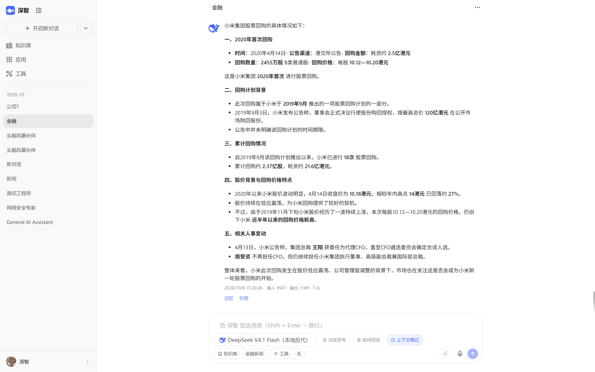
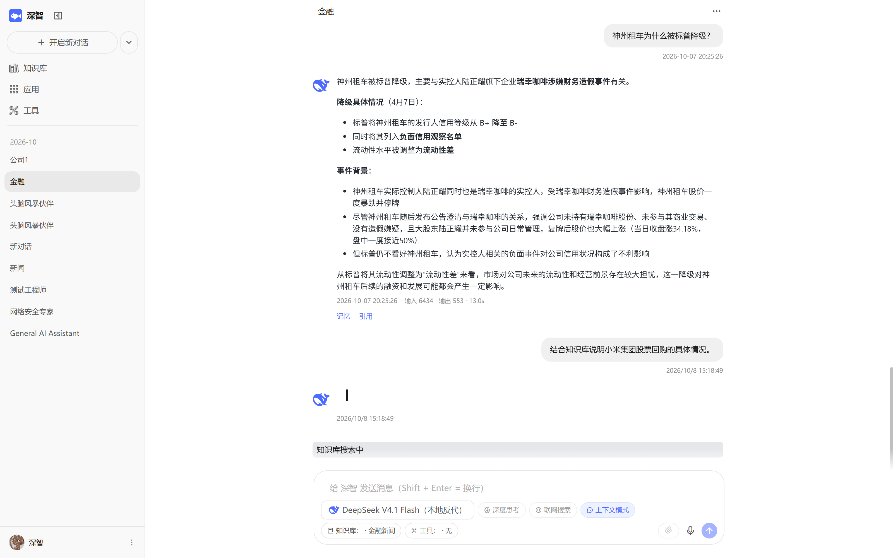
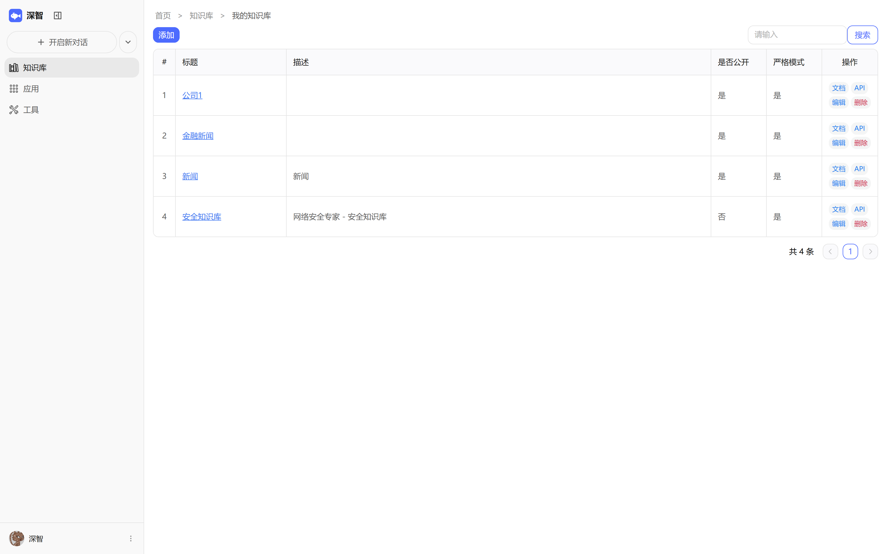
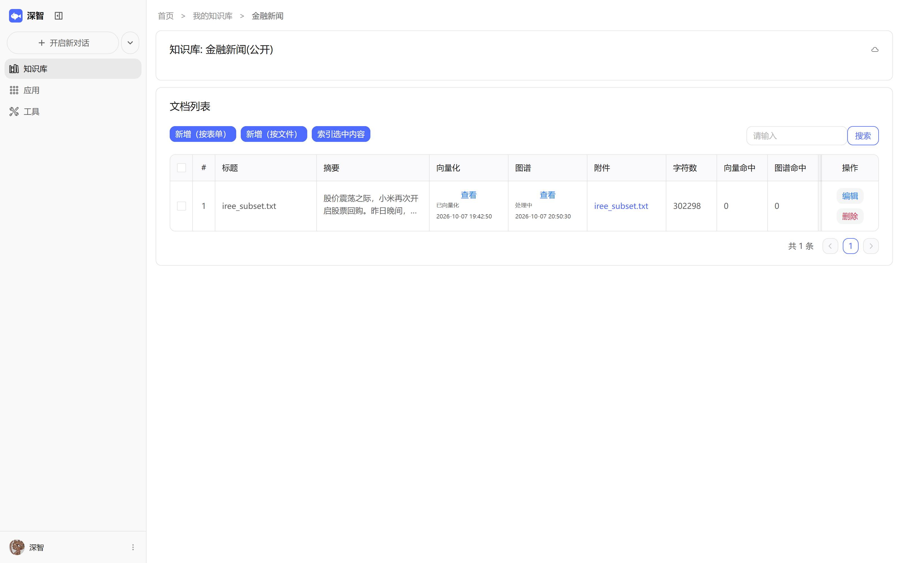
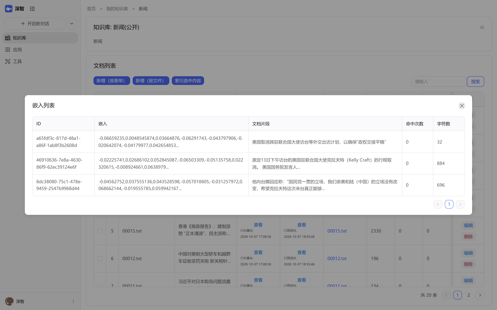
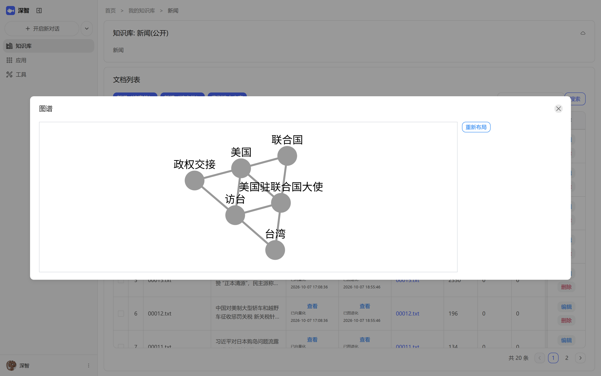
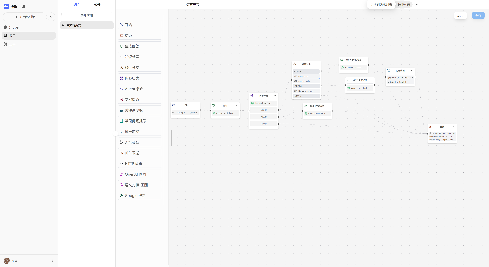
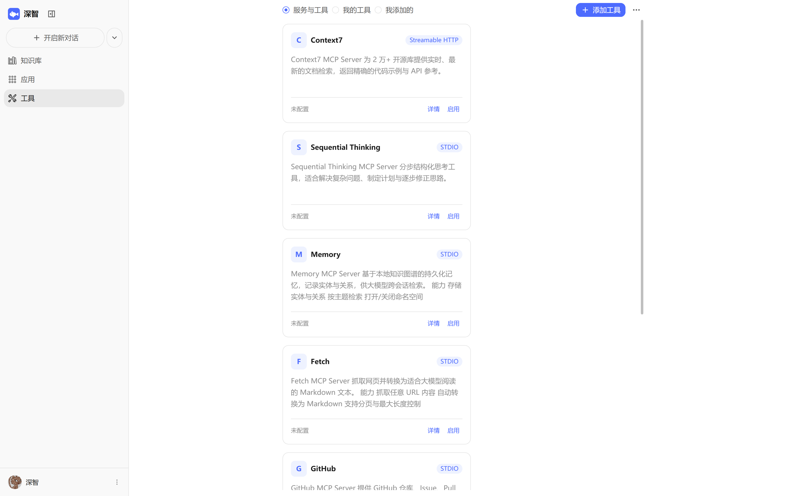

# 深智

AI 应用平台，集成 AI 对话、知识库（RAG / GraphRAG）、工作流编排、长短期记忆与 MCP 工具能力，可用于快速搭建智能业务助手。

支持多模型接入、可视化流程编排与知识图谱增强检索，开箱即用的对话式 AI 中台。

## 功能预览

### AI 对话

多角色、多会话并行管理，可绑定知识库与 MCP 工具。支持流式输出、思考模式、联网搜索与上下文模式切换；单条回复展示输入/输出 token 消耗与耗时，并可直接跳转查看命中的记忆与引用来源。



生成过程中实时展示检索与推理状态：



### 知识库

按知识库组织文档，支持表单录入或文件上传，文档自动切片、向量化并构建图谱索引，列表实时展示向量化/图谱状态、字符数与命中次数。





文档切片后逐片生成向量（可选配嵌入模型），并提供可视化嵌入列表便于核对检索效果：



### GraphRAG 知识图谱

文档在向量化之外额外抽取实体与关系，构建知识图谱。检索时可命中图谱，前端以图结构展示实体（人物 / 机构 / 地理 / 事件）及其关联，并支持点击查看实体详情与重新布局。



### AI 工作流编排

可视化画布编排，节点覆盖开始/结束、内容生成、知识检索、条件分支、内容归类、Agent、文档提取、关键词提取、常见问题提取、模板转换、人机交互、邮件发送、HTTP 请求与绘图等；支持条件分支与多路并行分支。



### MCP 工具

接入 MCP 服务扩展模型可用的工具与数据源，支持 Streamable HTTP 与 STDIO 两种传输方式，可对每个工具单独启用并配置自定义参数。



## 技术栈

- **后端**：Java 17 + Spring Boot 3 + langchain4j + langgraph4j + MyBatis-Plus
- **存储**：PostgreSQL（pgvector 向量检索）、Neo4j / Apache AGE（图存储）、Redis
- **前端**：Vue 3 + Vite + TypeScript + Naive UI

## 目录结构

| 目录 | 说明 |
|:-----|:-----|
| `server/` | 后端服务，Maven 多模块 |
| ├─ `adi-common` | 实体、DTO、Mapper、模型适配、RAG、工作流引擎等公共能力 |
| ├─ `adi-chat` | 用户端接口 |
| ├─ `adi-admin` | 管理端接口 |
| └─ `adi-bootstrap` | 启动模块，聚合以上三个模块 |
| `user-web/` | 用户端前端 |
| `admin-web/` | 管理端前端 |
| `docker/` | 部署编排 |

## 功能模块

| 模块 | 说明 |
|:-----|:-----|
| AI 对话 | 多角色多会话，可配置提示词、模型与参数，支持流式输出 |
| 知识库 | 文档切片向量化，支持向量检索与知识图谱（GraphRAG）两种方式 |
| AI 工作流 | 可视化编排，支持条件分支与并行执行，内置 LLM 调用、知识库检索、人工反馈等节点 |
| 图片生成 | 文生图与图片编辑 |
| ASR / TTS | 语音识别与语音合成，支持文字与语音的组合输入输出 |
| 长短期记忆 | 自动从对话中提取关键信息并沉淀，支持基于历史上下文的个性化回复 |
| MCP 工具 | 接入 MCP 服务，扩展模型可用的工具与数据源 |
| Open API | 为角色、知识库、工作流提供 RESTful API，支持流式与阻塞两种响应 |

## 快速开始

### 1. 准备依赖服务

- PostgreSQL，需安装 [pgvector](https://github.com/pgvector/pgvector) 扩展，用于向量检索
- Redis
- 图存储二选一：Neo4j 或 PostgreSQL + [Apache AGE](https://github.com/apache/age)

### 2. 初始化数据库

按顺序执行 `server/db_migration/` 下的 SQL 脚本，其中 `001_3.21.0.sql` 为基础建表，其余为增量迁移。

### 3. 启动后端

复制配置样板并按实际环境修改：

```bash
cp server/adi-bootstrap/src/main/resources/application-dev.yml.example \
   server/adi-bootstrap/src/main/resources/application-dev.yml
```

然后构建并启动：

```bash
cd server
mvn clean install
mvn spring-boot:run -pl adi-bootstrap
```

### 4. 启动前端

```bash
cd user-web     
pnpm install
pnpm run dev
```

## 部署

`docker/` 目录下提供了完整的编排配置：

```bash
cd docker
cp .env.prod .env
docker compose up -d
```

本机开发时前后端分离更快，只把基础设施与后端放进容器：

```bash
cd docker
docker compose -f docker-compose.yml -f docker-compose.dev.yml up -d postgres neo4j redis aideepin-api
cd ../user-web && pnpm dev     # 浏览器打开 http://localhost:1002
```

> 注意：`aideepin-api` 只有叠加 `docker-compose.dev.yml` 才会把 `9999` 端口映射到宿主机，宿主机的 Vite 才能将 `/api` 代理过去。

## 说明

`server/local-repo/` 存放了 Maven Central 上缺失的两个依赖（`Happy-Captcha` 验证码、`age-jdbc` 图数据库驱动），后端通过 `file://` 本地仓库引入，构建时请勿删除该目录。

界面截图为本地部署的实际运行效果，图片存放在 `docx/screenshots/`。
